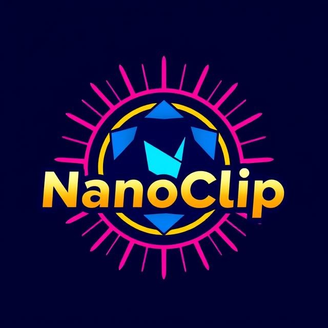

# NanoClip - Multiplayer Web Games Platform

A web-based platform for multiplayer games including:
- Shoot the Target (archery game)
- UNO (classic card game)
- Age of Wars (strategy game)

## Features
- User authentication (login/register/guest)
- Player profiles with statistics
- Game leaderboards
- Real-time multiplayer gameplay

## Getting Started

### Prerequisites
- Node.js (v16+ recommended)
- npm (comes with Node.js)
- Firebase project (for backend services)

### Installation
1. Clone the repository:
   - `git clone https://github.com/your-username/NanoClip.git`
   - `cd NanoClip/`

2. Install dependencies:
    - `npm install`

3. Run the development server:
    - `npm start`
    - Open `http://localhost:3000` to view in browser.

## Contributors
- Echim Eugen-Andrei
- Calu Andrei-Daniel
- Andrei Anca-Teodora
- Gheorghiță Vlad-Gabriel
- Ghiță Alexandru
- Șugă Șerban-Ionuț
